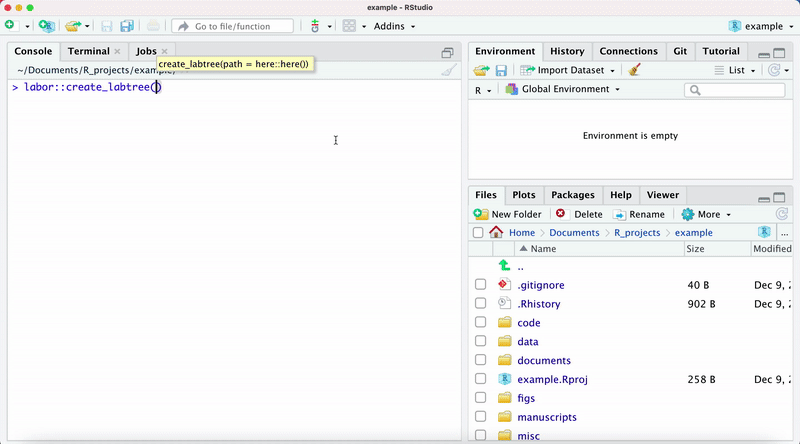
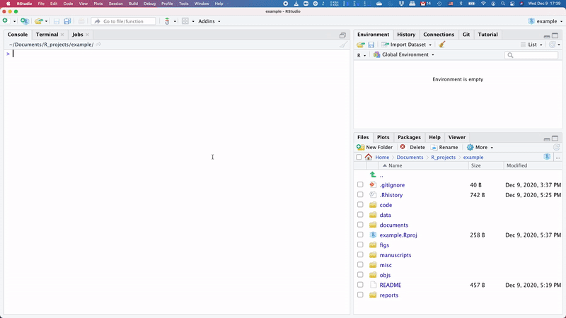
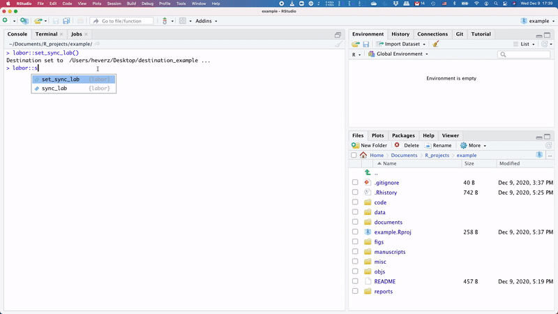
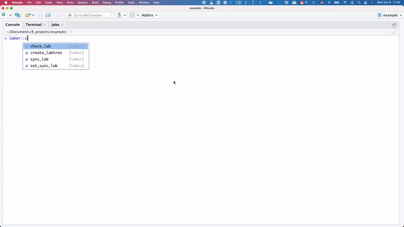

<!-- README.md is generated from README.Rmd. Please edit that file -->

# labor

<!-- badges: start -->

[](https://www.tidyverse.org/lifecycle/#experimental)

<!-- badges: end -->

The goal of `{labor}` is to keep your project folder structured, tidy
and to sync it easily to local folders.

The package works only on MacOs systems.

# Installation

Download the package in a local folder and then run the following code.

``` r
devtools::install_local("path_to_package")
```

Alternatively, you can install it directly from github.

``` r
library(devtools)
devtools::install_github("c1au6i0/labor")
```

# Usage

## Create a folder tree

To set up your lab folder, start running `create_labtree`.


The function generates the folder structure used for projects in our
lab, and relative `README` files.

If you run the function multiple types, you will be prompt to decide if
overwrite or not particular folders.



Use `remove_labtree` to remove the folders just created.

## Sync with local folder

Under the hood, the package `{labor}` use `rsync` to sync local folders.
Set up the destination folder using `set_sync_lab`



The destination folder is saved (`.labor_destination`) in a file in the
project directory .

Then run `sync_lab` to sync the project folder with the destination.



**Convenient things about `lab_sync` :**

1.  No need to retype origin and destination every time in `rsync`.
2.  Files containing authentication information and `renv` packages are
    not synced. You can use `exclude_files` to decide to not sync other
    specific files.
3.  You can bidirectional sync the folders by setting the argument
    `direction`
4.  You can still decide to use any `rsync` flags by setting the
    argument `rsync_flags` (default is `-avtuP`).

## Are you keeping things in the right place?

Run `check_lab` to see if you have messy directories.



The report generated indicates the absolute and over the total number of
files misplaced and it lists them.
